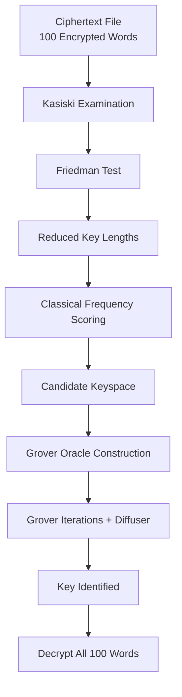

# Quantum Ciphertext-Only Cryptanalysis of the Vigenère Cipher  
Using Grover’s Algorithm (Qiskit 2.3.0)

---
# Quantum-Assisted Vigenère Cipher Key Recovery

## Introduction
Classical cryptography relies on the computational hardness of key search.  
While modern cryptosystems are designed to resist both classical and quantum attacks, 
historical ciphers such as the **Vigenère cipher** provide an excellent testbed for 
demonstrating **quantum algorithmic advantage** in structured search problems.

This repository presents a **hybrid classical–quantum cryptanalysis pipeline** that 
recovers the secret key used to encrypt a file containing **100 Vigenère-encrypted words**.  
The approach combines **classical cryptanalysis** for keyspace reduction with 
**Grover’s quantum search algorithm** for accelerated key discovery.

---

## Problem Statement
Given:
- A file containing **100 words encrypted using the Vigenère cipher**
- The encryption key is **unknown**
- Each encrypted word appears on a new line

Objective:
1. Analyze the ciphertext to infer likely key lengths and candidates
2. Reduce the exponential keyspace using classical cryptanalytic techniques
3. Apply **Grover’s algorithm** to search the remaining candidate space
4. Demonstrate **quantum advantage** via reduced oracle/query complexity
5. Recover the key and decrypt all 100 words

---

## Motivation
Classical brute-force attacks on the Vigenère cipher scale exponentially with key length:

$\[
\mathcal{O}(26^k)
]\$

Even with cryptanalytic heuristics, the final verification step remains a **search problem**.  
Grover’s algorithm offers a **provable quadratic speedup**, reducing search complexity to:

$\[
\mathcal{O}(\sqrt{N})
]\$

This project demonstrates:
- How quantum algorithms integrate into real cryptanalytic workflows
- Why hybrid classical–quantum approaches are essential on NISQ-era hardware
- How quantum advantage differs from quantum supremacy in practice

---

## Key Concepts Involved

### Classical Cryptanalysis
- **Kasiski Examination** – detects repeating patterns to infer key length
- **Friedman Test (Index of Coincidence)** – statistical key length estimation
- **Frequency Analysis** – χ² scoring against English letter distributions
- **Keyspace Reduction** – filters improbable keys before quantum search


#### Kasiski Examination
One can scan the ciphertext for repeated sequences of length 3 or more, note the distances between their occurrences, and then take the greatest common divisors of those distances. Those divisors are strong candidates for the key length because they reflect the periodicity of the repeating key. In practice, you might find several distances like 24, 36, and 60, whose common divisors are 3, 6, and 12, giving you a shortlist of plausible key lengths.

#### Friedman Test
It is a statistical way to estimate key length without relying on repeated patterns. The idea is that English text has a characteristic IC around 0.065, whereas uniformly random text has a much lower IC around 0.038. If you assume a key length 𝑘, you split the ciphertext into 𝑘 columns by taking every k-th letter. Each column should behave like a Caesar cipher of English text, so its IC should be close to the English value if your guess for 𝑘 is correct. By computing IC for different candidate lengths and comparing them to the expected English IC, you can estimate the most likely key length. This method is especially useful when the ciphertext is long and pattern repetition is not obvious.

#### Frequency Analysis
It is used to recover each key character. For a given position in the key, you take the corresponding column of ciphertext letters and treat it as a Caesar-shifted version of English text. For each possible shift from 0 to 25, you “decrypt” that column and compute a χ² (chi-squared) score comparing the observed letter frequencies with known English letter frequencies. The shift that minimizes the χ² score is the most likely key letter for that position. Doing this independently for each column gives you the full key.

#### Keyspace Reduction
is the idea of using all the above classical insights to drastically reduce the number of candidate keys before doing any exhaustive or quantum search. Instead of searching all 
$\
\mathcal26^k
\$ possible keys, you keep only those key lengths supported by Kasiski and Friedman, and for each key position you keep only the few shifts that have good χ² scores. This shrinks the search space from astronomically large to something manageable

### Quantum Algorithms
- **Grover’s Search Algorithm**
- **Phase Oracle Construction**
- **Diffuser (Inversion About the Mean)**
- **Amplitude Amplification**
- **Query Complexity Analysis**

---

## Overall Workflow


---
## Why Grover’s Algorithm (and Not Shor’s)?

Shor’s algorithm is designed for problems with strong algebraic structure, such as
integer factorization and discrete logarithms, which underpin public-key
cryptosystems like RSA and ECC.

The Vigenère cipher key-recovery problem does **not** possess such structure.
Instead, it reduces to a **search problem with an efficiently verifiable solution**:

- A candidate key can be tested by decrypting the ciphertext
- The correctness of the key can be verified using statistical language metrics
- No known algebraic shortcut exists for directly computing the key

Grover’s algorithm is therefore the theoretically optimal quantum algorithm for this
task, offering a **quadratic speedup** over classical search:

$$\[
\mathcal{O}(N) \;\rightarrow\; \mathcal{O}(\sqrt{N})
]\$$

This makes Grover’s algorithm the natural choice for accelerating Vigenère
cryptanalysis in the NISQ era.

---

#  Grover Oracle for Vigenère Cipher Key Search

## 1. n-gram Log-Likelihood Score Function

We define an English-likeness score based on n-gram statistics.

<div align="center">

$\[
\mathcal{S}_{n\text{-gram}}(\mathcal{P})
=\sum_{i=0}^{N-n}
\log \Pr\big(p_i p_{i+1} \dots p_{i+n-1}\big)
\]$

</div>

### Explanation of Terms

- \( \mathcal{P} = (p_0, p_1, \dots, p_{N-1}) \) is the decrypted plaintext  
- \( n \) is the size of the n-gram (e.g., 2 = bigram, 3 = trigram)  
- \( \Pr(p_i p_{i+1} \dots p_{i+n-1}) \) is the probability of that n-gram in English  
- The sum aggregates log-likelihood across the entire message  

 **Higher score ⇒ more likely valid English plaintext**

---

## 2. Decryption Function for Vigenère Cipher

Given a key \( \mathcal{K} \) and ciphertext \( \mathcal{C} \), decryption is:

<div align="center">

\[
p_i = (c_i - k_{i \bmod m}) \mod 26
\]

</div>

### Where:

- \( \mathcal{C} = (c_0, c_1, \dots, c_{N-1}) \) is ciphertext  
- \( \mathcal{K} = (k_0, k_1, \dots, k_{m-1}) \) is the key  
- \( m \) = key length  
- \( p_i \) = decrypted plaintext character  

Define the **decryption operator**

<div align="center">

\[
\mathcal{D}_{\mathcal{K}}(\mathcal{C}) = \mathcal{P}^{(\mathcal{K})}
\]

</div>

---

## 3. English-Validity Decision Function

We define a Boolean predicate that decides whether a key produces valid English:

<div align="center">

\[
\mathcal{F}(\mathcal{K}) =
\begin{cases}
1 & \text{if } \mathcal{S}\big(\mathcal{D}_{\mathcal{K}}(\mathcal{C})\big) \ge \tau \\
0 & \text{otherwise}
\end{cases}
\]

</div>

### Where:

- \( \mathcal{S}(\cdot) \) is the n-gram score  
- \( \tau \) is a chosen threshold  
- Output is **1 for correct key**, 0 otherwise  

---

## 4. Grover Phase Oracle

The Grover oracle flips the phase of valid keys:

<div align="center">

\[
\mathcal{O}_{\mathcal{F}} \, |\mathcal{K}\rangle
=
(-1)^{\mathcal{F}(\mathcal{K})}
|\mathcal{K}\rangle
\]

</div>

### Meaning

- If key \( \mathcal{K} \) is valid → phase flip \( (-1) \)
- If invalid → state unchanged  

---

## 5. Full Oracle Expression (Expanded)

Substituting the decision function:

<div align="center">

\[
\mathcal{O}_{\mathcal{F}} |\mathcal{K}\rangle
=
(-1)^{
\left[
\mathcal{S}\big(
\mathcal{D}_{\mathcal{K}}(\mathcal{C})
\big)
\ge \tau
\right]
}
|\mathcal{K}\rangle
\]

</div>

---

## 6. Complete Logical Flow of the Oracle

For each candidate key \( \mathcal{K} \):

1. Decrypt ciphertext  
   \[
   \mathcal{P}^{(\mathcal{K})} = \mathcal{D}_{\mathcal{K}}(\mathcal{C})
   \]

2. Compute English score  
   \[
   s = \mathcal{S}(\mathcal{P}^{(\mathcal{K})})
   \]

3. Compare with threshold \( \tau \)

4. Apply phase flip if valid  

---

## 7. Final Compact Oracle Definition

<div align="center">

\[
\boxed{
\mathcal{O}_{\mathcal{F}} |\mathcal{K}\rangle
=
(-1)^{
\left[
\mathcal{S}\big(
\mathcal{D}_{\mathcal{K}}(\mathcal{C})
\big)
\ge \tau
\right]
}
|\mathcal{K}\rangle
}
\]

</div>

---

## 8. Practical Simplified Oracle (Pattern Based)

For implementable circuits, we often replace the score with pattern detection:

<div align="center">

\[
\mathcal{F}(\mathcal{K}) =
1 \quad \text{if substring "THE" appears in } \mathcal{D}_{\mathcal{K}}(\mathcal{C})
\]

</div>

Then the oracle becomes:

<div align="center">

\[
\mathcal{O}_{\mathcal{F}} |\mathcal{K}\rangle
=
(-1)^{
[\text{"THE"} \subset \mathcal{D}_{\mathcal{K}}(\mathcal{C})]
}
|\mathcal{K}\rangle
\]

</div>


---


## Visualization Theory: Amplitude Amplification

Grover’s algorithm can be understood geometrically as a sequence of rotations in a
two-dimensional subspace spanned by:

- $\(|w\rangle\)$: the superposition of valid keys
- $\(|r\rangle\)$: the superposition of invalid keys

Starting from a uniform superposition \(|\psi_0\rangle\), each Grover iteration applies:
1. A **phase oracle**, which flips the phase of valid states
2. A **diffuser (inversion about the mean)**, which amplifies their amplitudes

After $\(k\)$ iterations, the state evolves as:

$\[
|\psi_k\rangle = \sin((2k + 1)\theta)\,|w\rangle + \cos((2k + 1)\theta)\,|r\rangle
\]$

where:

$\[
\sin^2(\theta) = \frac{M}{N}
\]$

Here, $\(M\)$ is the number of valid keys and \(N\) is the total size of the reduced
keyspace. The probability of measuring a valid key increases monotonically until it
approaches unity.

---

## Benchmarking and Quantum Advantage

### Computational Complexity

| Approach | Search Complexity |
|--------|-------------------|
| Classical brute-force | $\( \mathcal{O}(N) \)$ |
| Classical cryptanalysis + verification | $\( \mathcal{O}(N') \)$ |
| Grover’s algorithm | $\( \mathcal{O}(\sqrt{N'}) \)$ |

Here, $\(N'\)$ represents the reduced keyspace obtained after classical cryptanalysis.

---

### Oracle / Verification Cost

In practical cryptanalysis, the dominant cost is **key verification**, not key
generation. This makes oracle-call complexity the correct metric for comparison.

| Method | Verification Calls |
|------|---------------------|
| Classical verification | $\( N' \)$ |
| Grover’s search | $\( \frac{\pi}{4}\sqrt{N'} \)$ |

This reduction in verification cost constitutes the demonstrated **quantum
advantage**.

---

## Requirements

- Python 3.9 or higher
- Qiskit 2.3.0
- NumPy
- SciPy
- Matplotlib

Install all dependencies using:
```bash
pip install -r requirements.txt
```
---
## Author

Prashik N Somkuwar  


