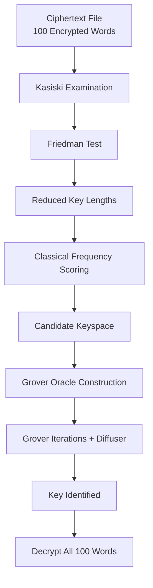

# Quantum Ciphertext-Only Cryptanalysis of the Vigenère Cipher  
Using Grover’s Algorithm (Qiskit 2.3.0)

---
# Quantum-Assisted Vigenère Cipher Key Recovery

## Introduction
Classical cryptography relies on the computational hardness of key search.  
While modern cryptosystems are designed to resist both classical and quantum attacks, 
historical ciphers such as the **Vigenère cipher** provide an excellent testbed for 
demonstrating **quantum algorithmic advantage** in structured search problems.

This repository presents a **hybrid classical–quantum cryptanalysis pipeline** that 
recovers the secret key used to encrypt a file containing **100 Vigenère-encrypted words**.  
The approach combines **classical cryptanalysis** for keyspace reduction with 
**Grover’s quantum search algorithm** for accelerated key discovery.

---

## Problem Statement
Given:
- A file containing **100 words encrypted using the Vigenère cipher**
- The encryption key is **unknown**
- Each encrypted word appears on a new line

Objective:
1. Analyze the ciphertext to infer likely key lengths and candidates
2. Reduce the exponential keyspace using classical cryptanalytic techniques
3. Apply **Grover’s algorithm** to search the remaining candidate space
4. Demonstrate **quantum advantage** via reduced oracle/query complexity
5. Recover the key and decrypt all 100 words

---

## Motivation
Classical brute-force attacks on the Vigenère cipher scale exponentially with key length:

$\[
\mathcal{O}(26^k)
\]$

Even with cryptanalytic heuristics, the final verification step remains a **search problem**.  
Grover’s algorithm offers a **provable quadratic speedup**, reducing search complexity to:

$\[
\mathcal{O}(\sqrt{N})
\]$

This project demonstrates:
- How quantum algorithms integrate into real cryptanalytic workflows
- Why hybrid classical–quantum approaches are essential on NISQ-era hardware
- How quantum advantage differs from quantum supremacy in practice

---

## Key Concepts Involved

### Classical Cryptanalysis
- **Kasiski Examination** – detects repeating patterns to infer key length
- **Friedman Test (Index of Coincidence)** – statistical key length estimation
- **Frequency Analysis** – χ² scoring against English letter distributions
- **Keyspace Reduction** – filters improbable keys before quantum search

### Quantum Algorithms
- **Grover’s Search Algorithm**
- **Phase Oracle Construction**
- **Diffuser (Inversion About the Mean)**
- **Amplitude Amplification**
- **Query Complexity Analysis**

---

## Overall Workflow


---
## Why Grover’s Algorithm (and Not Shor’s)?

Shor’s algorithm is designed for problems with strong algebraic structure, such as
integer factorization and discrete logarithms, which underpin public-key
cryptosystems like RSA and ECC.

The Vigenère cipher key-recovery problem does **not** possess such structure.
Instead, it reduces to a **search problem with an efficiently verifiable solution**:

- A candidate key can be tested by decrypting the ciphertext
- The correctness of the key can be verified using statistical language metrics
- No known algebraic shortcut exists for directly computing the key

Grover’s algorithm is therefore the theoretically optimal quantum algorithm for this
task, offering a **quadratic speedup** over classical search:

$\[
\mathcal{O}(N) \;\rightarrow\; \mathcal{O}(\sqrt{N})
\]$

This makes Grover’s algorithm the natural choice for accelerating Vigenère
cryptanalysis in the NISQ era.

---

## Visualization Theory: Amplitude Amplification

Grover’s algorithm can be understood geometrically as a sequence of rotations in a
two-dimensional subspace spanned by:

- $\(|w\rangle\)$: the superposition of valid keys
- $\(|r\rangle\)$: the superposition of invalid keys

Starting from a uniform superposition \(|\psi_0\rangle\), each Grover iteration applies:
1. A **phase oracle**, which flips the phase of valid states
2. A **diffuser (inversion about the mean)**, which amplifies their amplitudes

After $\(k\)$ iterations, the state evolves as:

$\[
|\psi_k\rangle = \sin((2k + 1)\theta)\,|w\rangle + \cos((2k + 1)\theta)\,|r\rangle
\]$

where:

$\[
\sin^2(\theta) = \frac{M}{N}
\]$

Here, $\(M\)$ is the number of valid keys and \(N\) is the total size of the reduced
keyspace. The probability of measuring a valid key increases monotonically until it
approaches unity.

---

## Benchmarking and Quantum Advantage

### Computational Complexity

| Approach | Search Complexity |
|--------|-------------------|
| Classical brute-force | \( \mathcal{O}(N) \) |
| Classical cryptanalysis + verification | \( \mathcal{O}(N') \) |
| Grover’s algorithm | \( \mathcal{O}(\sqrt{N'}) \) |

Here, $\(N'\)$ represents the reduced keyspace obtained after classical cryptanalysis.

---

### Oracle / Verification Cost

In practical cryptanalysis, the dominant cost is **key verification**, not key
generation. This makes oracle-call complexity the correct metric for comparison.

| Method | Verification Calls |
|------|---------------------|
| Classical verification | \( N' \) |
| Grover’s search | \( \frac{\pi}{4}\sqrt{N'} \) |

This reduction in verification cost constitutes the demonstrated **quantum
advantage**.

---

## Requirements

- Python 3.9 or higher
- Qiskit 2.3.0
- NumPy
- SciPy
- Matplotlib

Install all dependencies using:
```bash
pip install -r requirements.txt
```
---
## Author

Prashik N Somkuwar  


